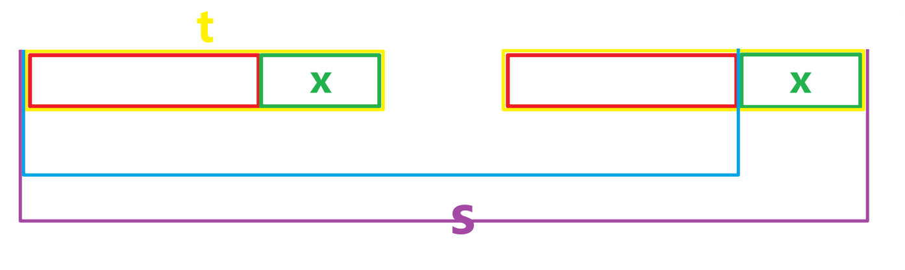
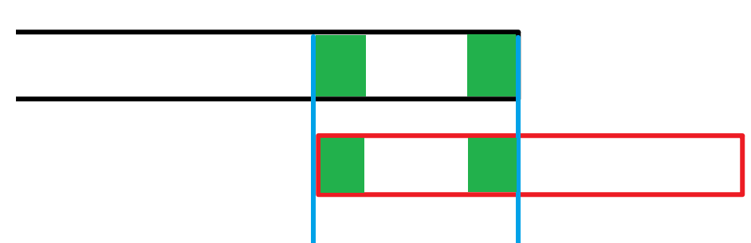

# KMP

## border

定义：一个字符串 $t$ 为字符串 $s$ 的 border 当且仅当 $t$ 为 $s$ 的真前缀，$t$ 为 $s$ 的真后缀。

性质：若 $t$ 为 字符串 $s$ 的 border，则 $t$ 的任意 border 均为 $s$ 的 border。

证明：设 $t'$ 为 $t$ 的 border，则 $t'$ 为 $t$ 的真前缀，而 $t$ 为 $s$ 的真前缀，故 $t'$ 为 $s$ 的真前缀。类似地，$t'$ 为 $s$ 的真后缀。所以 $t'$ 为 $s$ 的 border。

## 前缀函数

给定一个字符串 $s$，前缀函数表示 $s$ 的每个前缀的最长 border 的长度，这里用 `fail[]` 数组表示。

### 前缀函数的计算

前缀函数的计算基于该**结论**：

$t$ 是 $s$ 的一个 border，当且仅当存在 $x \in [1, |t|]$ 满足：

- $t(1:|t| - x)$ 为 $s(1:|s| - x)$ 的 border 或 $t(1:|t| - x)$ 不存在
- $t(|t| - x + 1 : |t|) = s(|s| - x + 1 : |s|)$

没看懂？来个图解：红色两段相等（蓝色串的 border）或不存在与绿色两段相等，当且仅当黄色两段（紫色串的 border）相等



这个结论其实很神奇，存在和任意是等价的。另外，这个结论也是关联 kmp 和 z 函数的关键结论。

我们在计算时可以取 $x = 1$，于是我们显然可以枚举 $s(1:|s| - 1)$ 的 border，然后再 check 一下 $x$ 段是否相等。找到满足条件的最大的 border 即可。

由于需要最大，我们考虑倒序枚举 border（而且 border 的性质限制了我们只能倒序枚举）并在找到第一个满足 $x$ 段相同的时候退出即可。

```cpp
for (int i = 0; i < n; ++i) {
    // 计算 s[0:i] 的最长 border
    int border = 0;
    for (int j = fail[i]; j; j = fail[j]) {
        // 枚举 s[0:i-1] 的 border
        if (s[i] == s[j]) {
            // 检查 x 段是否相等，记录答案并退出
            border = j;
            break;
        }
    }
    if (border == 0) {
        // 如果没找到就是红色段为空的情况，再次检查 x 段
        if (s[0] == s[i]) {
            fail[i + 1] = 1;
        }
    } else {
        // 否则就是找到了最大的红色段，满足 x 段相等
        fail[i + 1] = border + 1;
    }
}
```

简化一下板子就有了：

```cpp
auto getFail (const std::string& s) {
    int n = s.size();
    std::vector<int> fail(n + 1);
    for (int i = 1, j = 0; i < n; ++i) {
        while (j && s[i] != s[j]) j = fail[j];
        fail[i + 1] = j += (s[i] == s[j]);
    }
    return fail;
}
```

时间复杂度证明：$i, j$ 的变化次数是 $O(n)$ 的，所以时间复杂度是 $O(n)$。

### 利用前缀函数完成字符串匹配

核心结论是，如果我们已经匹配了 $s$，那么一定匹配了 $s$ 的 border，且不存在比 $s$ 更短的非 border 串匹配成功。

其实很简单，根据 border 的定义可以轻松证明：红色的是模式串。如果蓝色的部分已经匹配了，绿色代表匹配成功的串的 border



所以我们就暴力匹配，匹配没成功就跳 border 即可。[板子题](https://www.luogu.com.cn/problem/P3375)

```cpp
auto getFail (const std::string& s) {
    int n = s.size();
    std::vector<int> fail(n + 1);
    for (int i = 1, j = 0; i < n; ++i) {
        while (j && s[i] != s[j]) j = fail[j];
        fail[i + 1] = j += (s[i] == s[j]);
    }
    return fail;
}

void Thephix() {
    string s, t;
    cin >> s >> t;

    int n = s.size(), m = t.size();
    auto fail = getFail(t);
    for (int i = 0, j = 0; i < n; ++i) {
        while (j && s[i] != t[j]) j = fail[j];
        j += s[i] == t[j];
        if (j == m) {
            cout << i - m + 2 << "\n";
            j = fail[j];
        }
    }

    for (int i = 1; i <= m; ++i) {
        cout << fail[i] << " \n"[i == m];
    }
}
```

## 失配树 / border tree

border 的长度一定小于当前前缀的长度，即 $\operatorname{fail}(x) \leq x$。那么我们构造一棵 $n + 1$ 个节点的有向有根树：

$$
tr = (V = \{0, 1, 2, \cdots, n\}, E = \{\langle u, \operatorname{fail}(u)\rangle | u = 1, 2, \cdots, n\})
$$

这棵树就是失配树，和 AC 自动机的失配树其实是同一个东西。另外由于每个节点的所有非根祖先对应着该节点的所有 border，所以也称为 border tree。

用 border tree 来理解 border 的结构还是很

### KMP 自动机

`dp[i][ch]` 表示在匹配了 $i$ 个字符的情况下，如果下一个字符串是 $ch$，应该匹配的字符的个数。构造起来还是很简单的：

```cpp

```